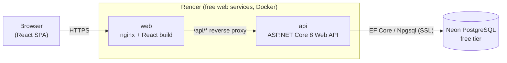

# StockSense

**Simple stock tracking and reorder alerts for small independent retailers.**
| | |
|---|---|
| **Live app** | https://YOUR-WEB-SERVICE.onrender.com |
| **API docs (Swagger)** | https://YOUR-API-SERVICE.onrender.com/swagger |
| **Demo login** | `demo@stocksense.app` / `Demo1234!` |

> The app is hosted on free tiers. If nobody has used it for a while the services sleep, so the first request can take up to about a minute. Open it a minute before you need it.

---

## 1. The problem

### Who it affects

Small independent retailers such as spaza shops, corner shops and township grocers. Accenture Africa research, as reported by [Daily Investor](https://dailyinvestor.com/retail/26514/south-african-spaza-shop-market-bigger-than-shoprite/), counts more than 150,000 spaza shops in South Africa, a sector valued at around R178 billion, with roughly 80% of the population shopping at them daily and about 40% of annual food spend passing through them.

Despite that scale, many of these businesses are owner-run without any inventory software, so stock is often tracked from memory or in a notebook.

### Why it matters

- **Stock-outs cost sales.** A customer who finds an empty shelf for bread, milk or airtime buys elsewhere. For a shop with thin margins, a few lost sales a day add up.
- **Stock loss cuts profit.** A study of small retailers in Pretoria by Tabane, Phume and Retief ([*Effects of physical stock loss on the financial performance of retail enterprises*, SAJEMS](https://sajems.org/index.php/sajems/article/view/5410)) found that stock spoilage and internal theft were the strongest predictors of lost profitability and sales volume. A shop that cannot see what it should have on its shelves cannot notice what went missing.
- **Cash gets tied up in the wrong stock.** Without numbers, owners over-order slow movers and under-order fast ones. Accenture's research notes that spaza owners often buy through wholesalers in limited ranges, which already raises their costs, so every wasted rand hurts more.
- **Existing tools are a poor fit.** Enterprise point-of-sale and ERP systems are costly and complex. A spreadsheet needs discipline that a busy shop owner does not have.

### How StockSense solves it

StockSense is a deliberately small tool that does three things well:

1. **Keeps a live count** of every product, with an audit trail of every stock-in and stock-out (delivery received, sold, spoiled, stolen), so shrinkage becomes visible.
2. **Warns before stock runs out.** Each product has a reorder level. When stock reaches it, the item appears on a reorder list with a suggested order quantity.
3. **Shows the money.** A dashboard shows units on hand, stock value at cost, and per-product margin, so owners can see where their cash is sitting.

### Target users

| User | Need |
|---|---|
| Spaza / corner-shop owner | Know what to buy at the wholesaler this week, without a spreadsheet |
| Small grocer or tuck-shop with one or two staff | A shared record of what came in and what went out |
| Market and informal traders | Basic margin and stock-value numbers on a phone |

The interface is responsive so it works on a phone, which is the device most small traders actually have.

---

## 2. Features

- Register / sign in (JWT authentication, bcrypt-hashed passwords)
- Product catalogue with SKU, category, cost price, selling price, quantity and reorder level
- Record stock in / stock out with a reason; stock can never go below zero
- Full movement history per product
- Reorder list with a suggested order quantity (restock to twice the reorder level)
- Dashboard: product count, units, stock value, items needing reorder
- Search by name or SKU
- Each shop only ever sees its own data (every query is scoped to the signed-in owner)
- Swagger UI for the whole API

---

## 3. Architecture



| Service | Tech | Role |
|---|---|---|
| `frontend/` (`web`) | React 18, TypeScript, Vite, served by nginx | UI. nginx serves the static build and reverse-proxies `/api/*` to the backend, so the browser talks to a single origin (no CORS headaches). |
| `backend/` (`api`) | ASP.NET Core 8 Web API, EF Core, JWT, Swashbuckle | REST API and business rules |
| Database | PostgreSQL | **Locally:** a container from `docker-compose.yml`. **Deployed:** a hosted free-tier database on Neon, so data survives redeploys. |

**Why this design**

- **ASP.NET Core Web API** over Azure Functions: a conventional layered API (controllers, services, EF Core) is easier to test and containerise, and the same image runs locally and on Render.
- **Business rules live in `StockService`/`AuthService`**, not in controllers, so they are unit-tested without HTTP.
- **Tenant isolation** is enforced in the service layer: every query filters by the owner id from the JWT.
- **Hosted DB for production, container DB for local**: free hosting platforms wipe container filesystems on restart, so a database inside a container would lose its data.

### Repository layout

```
.
├── backend/
│   ├── Dockerfile
│   ├── StockSense.sln
│   ├── StockSense.Api/        controllers, services, EF Core models
│   └── StockSense.Tests/      xUnit tests
├── frontend/
│   ├── Dockerfile
│   ├── nginx.conf.template
│   └── src/                   React + TypeScript
├── .github/workflows/         ci-cd.yml, codeql.yml
├── docker-compose.yml
└── .env.example
```

---

## 4. Run it locally

**Prerequisites:** [Docker Desktop](https://www.docker.com/products/docker-desktop/) (or Docker Engine with the Compose plugin) and Git.

```bash
git clone https://github.com/YOUR-USERNAME/stocksense.git
cd stocksense

cp .env.example .env        # Windows PowerShell: copy .env.example .env
# open .env and set JWT_KEY to a long random string (32+ characters)

docker compose up --build
```

| What | URL |
|---|---|
| Web app | http://localhost:3000 |
| API | http://localhost:8080 |
| Swagger UI | http://localhost:8080/swagger |
| Health check | http://localhost:8080/health |

With `SEED_DEMO_DATA=true` (the default in `.env.example`) a demo shop is created on first start. Sign in with `demo@stocksense.app` / `Demo1234!`, or create your own account.

Stop the stack with `Ctrl+C`, and remove containers and the local database volume with `docker compose down -v`.

### Running without Docker (for development)

```bash
# 1. a Postgres database, e.g. only the db container from compose
docker compose up db -d

# 2. the API (needs the .NET 8 SDK)
cd backend/StockSense.Api
export ConnectionStrings__Default="Host=localhost;Port=5432;Database=stocksense;Username=stocksense;Password=change-me-local-only"
export Jwt__Key="a-long-random-string-of-at-least-32-characters"
export SeedDemoData=true
export ASPNETCORE_URLS=http://localhost:8080
dotnet run

# 3. the frontend (needs Node 20+)
cd frontend && npm install && npm run dev      # http://localhost:5173
```

(The Vite dev server proxies `/api` to `http://localhost:8080`; change the target in `frontend/vite.config.ts` if your API runs on another port.)

---

## 5. Environment variables

See [`.env.example`](.env.example) for dummy values. The real `.env` is git-ignored.

| Variable | Used by | Purpose |
|---|---|---|
| `POSTGRES_DB`, `POSTGRES_USER`, `POSTGRES_PASSWORD` | compose `db` service | Local Postgres container credentials |
| `JWT_KEY` → `Jwt__Key` | api | Signing key for login tokens (32+ chars) |
| `CORS_ALLOWED_ORIGINS` → `Cors__AllowedOrigins` | api | Origins allowed to call the API directly from a browser |
| `SEED_DEMO_DATA` → `SeedDemoData` | api | `true` creates the demo shop on first start |
| `ConnectionStrings__Default` | api (production) | Neon connection string; URL form (`postgresql://...`) is accepted |
| `PORT` | api, web | Set automatically by Render; defaults to 8080 locally |
| `BACKEND_URL` | web | Where nginx proxies `/api/*` (`http://api:8080` in compose, the API's public URL on Render) |

In production these are set as **Render environment variables** and **GitHub Repository Secrets**. No credentials are committed to the repository.

---

## 6. API documentation

Swagger UI is built into the backend at `/swagger` (use the **Authorize** button and paste the token returned by `/api/auth/login`).

| Method | Endpoint | Description |
|---|---|---|
| POST | `/api/auth/register` | Create an account, returns a JWT |
| POST | `/api/auth/login` | Sign in, returns a JWT |
| GET | `/api/products?search=` | List products |
| POST | `/api/products` | Create a product |
| GET / PUT / DELETE | `/api/products/{id}` | Read, update, delete a product |
| POST | `/api/products/{id}/adjust` | Stock in (+) or out (-) with a reason |
| GET | `/api/products/{id}/movements` | Movement history |
| GET | `/api/dashboard/summary` | Headline numbers |
| GET | `/api/dashboard/low-stock` | Reorder list with suggested quantities |
| GET | `/health` | Liveness check |

---

## 7. Testing

```bash
dotnet test backend/StockSense.sln     # backend unit tests (xUnit + EF Core in-memory)
cd frontend && npm test                # frontend unit tests (Vitest)
```

The backend tests cover the rules that matter most: stock can never go negative, SKUs are unique per shop, one shop cannot see or change another shop's products, low-stock detection and suggested quantities, dashboard maths, password hashing and login behaviour.

---

## 8. CI/CD pipeline (GitHub Actions)

[`.github/workflows/ci-cd.yml`](.github/workflows/ci-cd.yml) runs on every pull request and every push to `main`:

| Stage | What it does |
|---|---|
| **Build & test** | Restores, builds and runs the .NET tests; installs, tests and builds the React app; checks NuGet and npm dependencies for known vulnerabilities |
| **Docker build** | `docker compose build`, then starts the whole stack and smoke-tests the API, the web app, and the nginx → API proxy path |
| **Security** | [Trivy](https://github.com/aquasecurity/trivy) scans the source, dependencies and secrets, then both built images. [CodeQL](.github/workflows/codeql.yml) analyses the C# and TypeScript code. Dependabot keeps dependencies current. |
| **Deploy** | Only on `main` and only after everything above passes: triggers Render deploy hooks for the API and the web service |

Secrets used by the pipeline (stored as GitHub Repository Secrets):

- `RENDER_API_DEPLOY_HOOK`
- `RENDER_WEB_DEPLOY_HOOK`

---

## 9. Deployment (free tiers only)

| Part | Provider | Notes |
|---|---|---|
| API container | Render (free web service, Docker) | Built from `backend/Dockerfile` |
| Web container | Render (free web service, Docker) | Built from `frontend/Dockerfile` |
| Database | Neon (free PostgreSQL) | Hosted outside the containers, so data survives restarts and redeploys |
| Images / CI | GitHub Actions, public repo | Free |

No payment details were required for any of these. Free-tier behaviour to be aware of: services sleep after a period of inactivity (first request is slow), and Render has a monthly cap on free instance hours.

---

## 10. Git workflow

- `main` is protected: no direct pushes, changes arrive through pull requests
- Work is done on short-lived feature branches (`feature/...`, `chore/...`, `docs/...`)
- Every pull request must pass the CI pipeline before it is merged
- Conventional commit messages (`feat:`, `fix:`, `chore:`, `docs:`, `test:`)

---

## 11. Author and contributions

| Member | GitHub | Contributions |
|---|---|---|
| Sabein Naidoo | [@ST10252574](https://github.com/ST10252574) | author: research, ASP.NET Core API, React frontend, Docker and Compose, CI/CD pipeline, deployment, documentation |

| Member | GitHub | Contributions |
|---|---|---|
| Ahilya Surujpal | [@ST10285098](https://github.com/ST10285098) | author: research, ASP.NET Core API, React frontend, Docker and Compose, CI/CD pipeline, deployment, documentation |


---

## 12. Limitations and future work

- Database tables are created with `EnsureCreated` for simplicity; a production system should use EF Core migrations.
- The auth token is kept in `sessionStorage`; a production system should prefer short-lived tokens with httpOnly refresh cookies.
- No barcode scanning, supplier management or sales-based forecasting yet. These are natural next steps, along with a progressive-web-app mode for offline use on poor connections.
